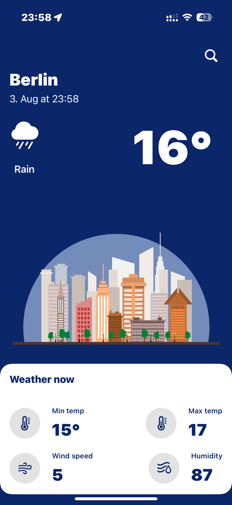
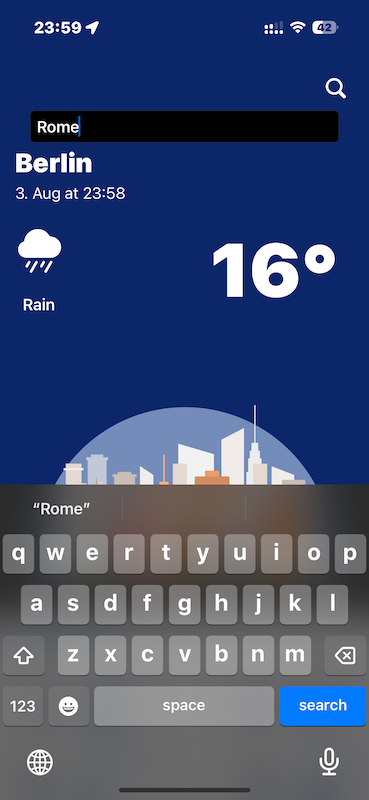

# WeatherApp

A basic Weather App built with SwiftUI.

## Overview

WeatherApp is a simple application designed to display weather information using a clean and minimal SwiftUI interface. The project serves as a starting point for learning Swift and SwiftUI, and can be extended with additional features as needed.

## Features

- Displays current weather information.
- Built with Swift and SwiftUI for iOS devices.
- Straightforward, beginner-friendly architecture.

## Technologies Used

- **Swift**
- **SwiftUI**

## Getting Started

1. Clone the repository:
   ```sh
   git clone https://github.com/devpool007/WeatherApp.git




